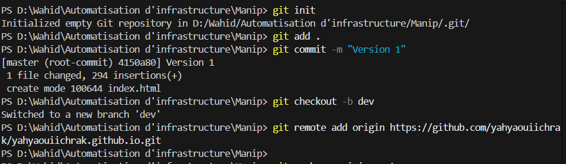
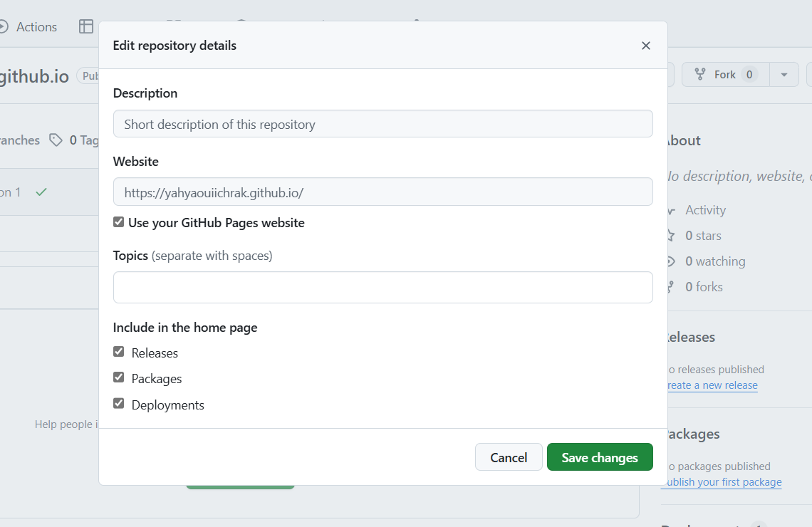
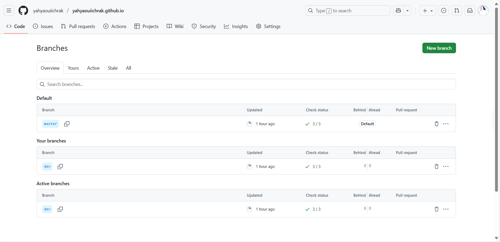
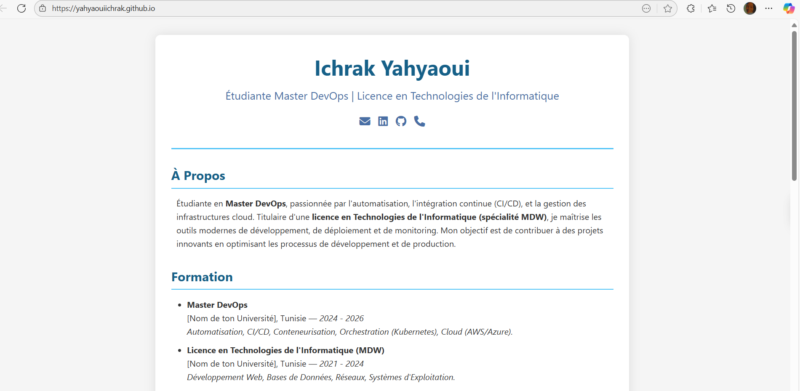
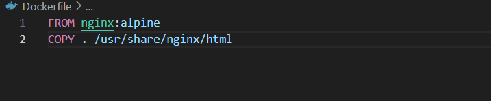
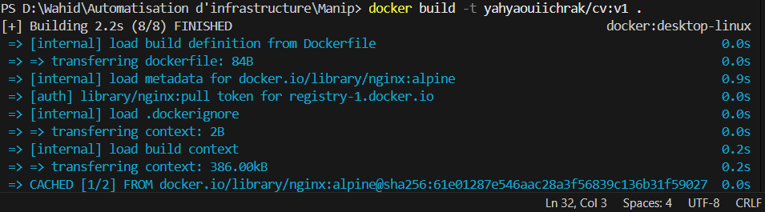
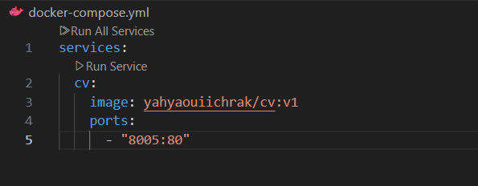
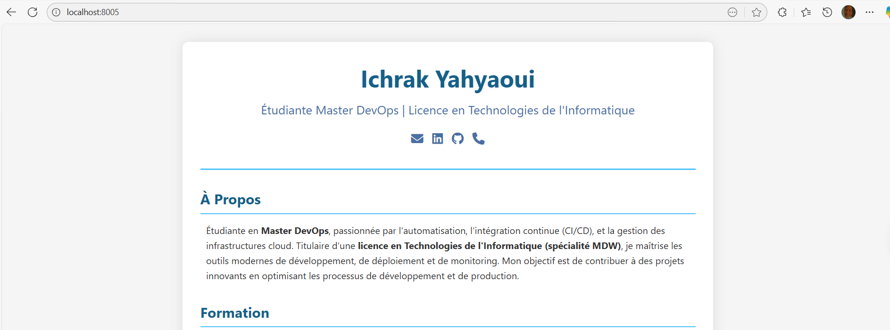
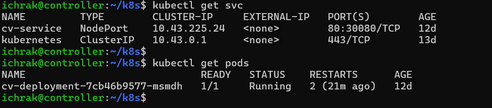
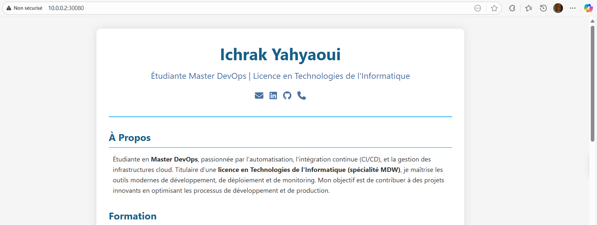

# TP CI/CD — Déploiement d'un CV One Page

## 🎯 Objectif
Réaliser un pipeline CI/CD complet pour déployer un CV One Page en HTML/CSS via GitHub Pages, Docker, Docker Compose et Kubernetes (K3S).

---

## 🧩 Partie 1 — Développement et déploiement initial

### 1. Création du CV HTML/CSS
- Fichiers créés : `index.html`
- Le CV est une page simple avec nom, compétences, expériences.

### 2. Initialisation Git
```bash
git init
git add .
git commit -m "Version 1"
```

### 3. Création de la branche `dev`
```bash
git checkout -b dev
```

- 

### 4. Dépôt GitHub Pages
- Nom du dépôt : `USERNAME.github.io`
- Branches poussées : `main` et `dev`
- Activation de GitHub Pages via les paramètres du dépôt

- 
- 
- 

### 5. Dockerisation du CV
- Fichier `Dockerfile` :
```Dockerfile
FROM nginx:alpine
COPY . /usr/share/nginx/html
```
- Création de l'image :
```bash
docker build -t DockerHubUsername/cv:v1 .
```
- Push sur Docker Hub :
```bash
docker login
docker push DockerHubUsername/cv:v1
```
- 
- 
- 

### 6. Déploiement avec Docker Compose
- Fichier `docker-compose.yml` :
```yaml
version: '3'
services:
  cv:
    image: DockerHubUsername/cv:v1
    ports:
      - "8005:80"
```
- Lancement :
```bash
docker-compose up
```
- 
- 

- Test : `http://localhost:8005`

- 

---

## 🧩 Partie 2 — Déploiement avec K3S

### 1. Création des VM Ubuntu Server 24.04
- 1 Controller, 2 Workers via Hyper-V

### 2. Installation de K3S
#### Sur le controller :
```bash
curl -sfL https://get.k3s.io | sh -
```
#### Sur les workers :
```bash
curl -sfL https://get.k3s.io | K3S_URL=https://<IP_CONTROLLER>:6443 K3S_TOKEN=<TOKEN> sh -
```

### 3. Configuration de kubectl
```bash
scp user@controller:/etc/rancher/k3s/k3s.yaml ~/.kube/config
```

### 4. Manifests Kubernetes
#### `cv-deployment.yaml`
```yaml
apiVersion: apps/v1
kind: Deployment
metadata:
  name: cv-deployment
spec:
  replicas: 1
  selector:
    matchLabels:
      app: cv
  template:
    metadata:
      labels:
        app: cv
    spec:
      containers:
      - name: cv
        image: DockerHubUsername/cv:v1
        ports:
        - containerPort: 80
```

#### `cv-service.yaml`
```yaml
apiVersion: v1
kind: Service
metadata:
  name: cv-service
spec:
  type: NodePort
  selector:
    app: cv
  ports:
  - port: 80
    targetPort: 80
    nodePort: 8006
```

### 5. Déploiement sur K3S
```bash
kubectl apply -f cv-deployment.yaml
kubectl apply -f cv-service.yaml
```

### 6. Test dans le navigateur
- URL : `http://<IP_NODE>:8006`

### 📸 Captures d'écran
- 
- 

---

## ✅ Conclusion
Ce TP permet de mettre en œuvre un pipeline CI/CD complet, du développement local jusqu'au déploiement sur un cluster Kubernetes.
